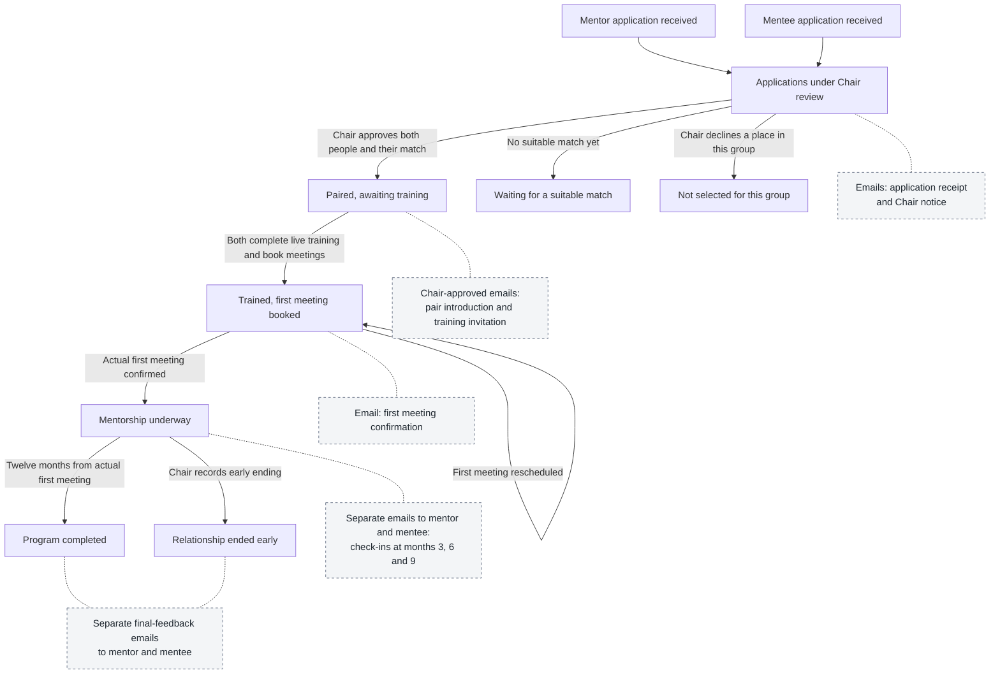

# The mentorship journey

One journey from two applications to a completed mentoring relationship. Solid arrows show what moves the journey forward. Dotted connections identify emails, not extra program states. The Chair approves every participant and match.

The pair starts its twelve months at the **actual first mentoring meeting**, not when matched, trained or booked. It meets for one hour in ten distinct months. The mentee keeps the next three to six meetings booked, or the remaining meetings near the end. Training is one live, one-hour online session attended together.

Waiting applicants may be reconsidered for a later group. The Chair may record an early ending at any point after matching, including before training or the first meeting; its path is drawn once to keep the diagram readable.

## Emails along the journey

The links below lead to each email's stored HTML. GitHub shows HTML source; download the repository and open [the email viewer](emails/index.html) to see the formatted messages.

| Point in the journey | Email and trigger | What happens if someone replies |
| --- | --- | --- |
| Before applying | Chair approves an [introduction to the program](emails/applications-open.html) or [mentor invitation](emails/mentor-invitation.html). These are not automatic campaigns. | Questions go to the Chair. Replying does not create an application; the person applies on the website. |
| Application received | Saving an application queues a [receipt](emails/application-received.html) and a separate [mentee](emails/chair-application-mentee.html) or [mentor](emails/chair-application-mentor.html) notice to the Chair. | Applicant questions or updates go to the Chair. A reply to the Chair notice does not approve an applicant. |
| Chair reviewing and matching | Chair may approve a [looking for a mentor](emails/moving-to-matching.html) update or a [not selected](emails/not-selected.html) message. Neither sends solely because a status changes. | Chair handles questions and requests to remain under consideration. No automatic approval or deletion follows from a reply. |
| Pair approved | Chair personalizes and approves the [introduction](emails/match-introduction.html) and [training invitation](emails/training-invitation.html). | Chair handles conflicts, questions and attendance arrangements. A reply does not itself mark training complete. |
| First meeting booked | After training is recorded, [first-meeting confirmation](emails/first-meeting.html) goes to the mentee the day after the booked date. | Clear attendance confirms the actual start date. Rescheduling updates the booking and follow-up. Unclear replies go to the Chair; silence never starts the cycle. |
| Mentorship underway | Separate [month 3](emails/check-in-3.html), [month 6](emails/check-in-6.html) and [month 9](emails/check-in-9.html) check-ins ask each person about meetings, value and contact needs. | Clear answers are recorded and classified. Questions, unclear answers and support requests go to the Chair. Feedback does not itself end the relationship. |
| Twelve months reached | [Mentee final feedback](emails/final-mentee-12.html) asks about progress and value. [Mentor final feedback](emails/final-mentor-12.html) asks about value and mentoring again. | Answers update program results. Finishing the twelve months does not mean everyone has answered or achieved a successful outcome. |
| Relationship ends early | Chair records the ending. Future quarterly requests and unfinished quarterly reminders stop; [mentee](emails/final-mentee-0.html) and [mentor](emails/final-mentor-0.html) final feedback replaces them. No message goes to someone whose information has been deleted. | Final answers update results under the same response rules. An early ending is still included in reporting. |

## When a requested response does not arrive

This applies to first-meeting confirmation and quarterly or final check-ins, not recruitment or general invitations.

- **Day 7 and day 14 after the original email:** remind only the person who has not genuinely replied. Check-ins use the [day 7](emails/reminder-7.html) and [day 14](emails/reminder-14.html) messages. First-meeting requests repeat their original question.
- **A genuine reply:** stops that person's no-response reminders. An automatic reply does not count. Partial answers remain incomplete and retain the original deadline.
- **Day 21:** [notify the Chair](emails/chair-deadline.html) if required information is still missing. Missing final outcome answers count as failures for their measures until corrected. This does not automatically end the pair's relationship.
- **Questions or problems:** the Chair receives the relevant [feedback](emails/chair-review.html), [meeting](emails/chair-meeting-review.html), [email](emails/chair-email-review.html) or [processing](emails/chair-processing-error.html) notice and handles it in program AI chat. Other outgoing replies use a [Chair-approved message](emails/custom-message.html).

The [user guide](USER_GUIDE.md) explains operation. The [Program Manual](program/program-manual.md) contains the full rules and canonical email wording. This diagram explains the journey; it does not introduce new states, approvals or automation into the software.
